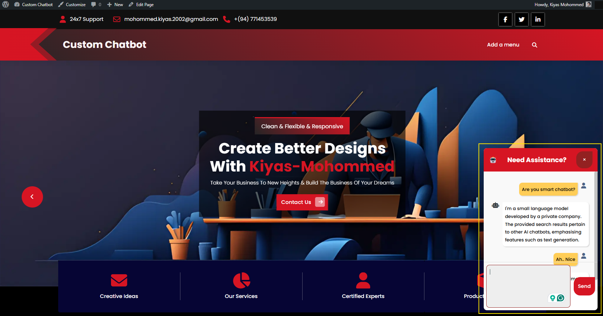

# WordPress AI Chatbot Plugin

A fully customizable, secure, and intelligent chatbot plugin for WordPress, powered by OpenAI's Assistant API. Designed to improve user engagement, provide real-time assistance, and enhance website interactivity with seamless integration and modern UI components.

## 🔧 Features

- 💬 Real-time chatbot conversation
- 🔐 Access restricted to logged-in users
- 🤖 Powered by OpenAI's Assistant API (Thread-based workflow)
- 📍 Geolocation input support
- 🛡️ Secure nonce-based request validation
- 🌐 Responsive and elegant design
- 🔄 Duplicate message prevention
- 🧠 Smart response formatting (Markdown > HTML)
- 📦 Easy to integrate into any WordPress theme

## 🚀 Technologies Used

- PHP (WordPress plugin structure)
- JavaScript (DOM interactions and fetch API)
- OpenAI Assistant API (Thread, Messages, Run)
- HTML/CSS (Custom chat UI)
- WordPress AJAX and REST API
- Font Awesome (Icons)

## 📷 Screenshots

## 📁 Installation

1. Clone or download the plugin to your `/wp-content/plugins/` directory.
2. Activate the plugin from your WordPress admin dashboard.
3. Go to **Settings > AI Chatbot** and configure:
   - OpenAI API Key
   - Default Prompt or Personality
   - Access Control (logged-in users only)
4. Use the `[ai_chatbot]` shortcode to place the chatbot anywhere on your site.

## ⚙️ Configuration

Ensure your site has the following:

- WordPress 5.5 or later
- OpenAI API key (configured via plugin settings)
- Logged-in user session (to use the chatbot)

## 📜 License

MIT License

---

Crafted with ❤️ by [Kiyas Mohommed](mailto:mohommed.kiyas.2002@gmail.com) | [LinkedIn](www.linkedin.com/in/kiyas-mohommed)
